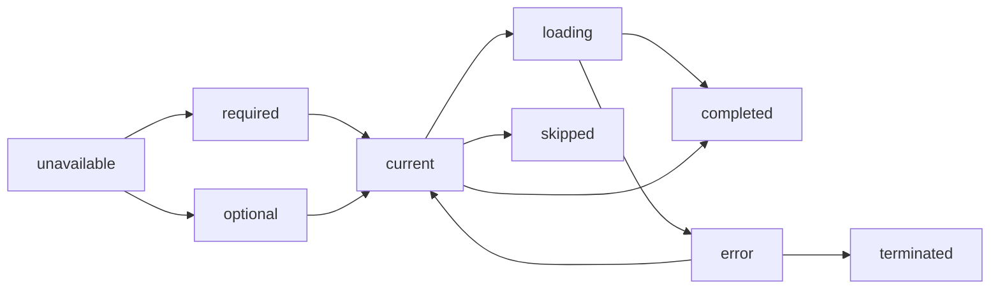

# @wizard/core

Deeply type-safe, isomorphic, headless multi-step wizard library with advanced status tracking and helper utilities.

## Features

- 🎯 **100% Type-Safe** - Full TypeScript support with deep type inference
- 🔄 **Isomorphic** - Works in Node.js and browsers
- 🎨 **Headless** - Bring your own UI, no style dependencies
- 📦 **Tiny** - ~10kb min+gz (excluding peer deps)
- 📊 **Advanced Status Tracking** - 9 different step statuses with lifecycle hooks
- 🧭 **Smart Navigation** - Prerequisites, guards, and intelligent pathfinding
- 📈 **Progress Tracking** - Linear and weighted progress calculations
- 🔌 **Extensible** - Pluggable validation, persistence, and routing

## Installation

```bash
npm install @wizard/core
# or
pnpm add @wizard/core
# or
yarn add @wizard/core
```

## Quick Start

```typescript
import { createWizard } from '@wizard/core';
import { createWizardFactory } from '@wizard/core';

// Option 1: Direct creation
const wizard = createWizard({
  context: { userId: null },
  steps: {
    welcome: {
      data: { name: '', email: '' },
      next: ['profile']
    },
    profile: {
      data: { bio: '', avatar: '' },
      next: ['review']
    },
    review: {
      data: { confirmed: false },
      next: []
    }
  }
});

// Option 2: Using factory (recommended for better type inference)
const { defineSteps, createWizard } = createWizardFactory();

const steps = defineSteps({
  welcome: {
    data: { name: '', email: '' },
    next: ['profile'],
    validate: ({ data }) => {
      // data is properly typed!
      if (!data.email.includes('@')) throw new Error('Invalid email');
    }
  },
  profile: {
    data: { bio: '', avatar: '' },
    next: ['review']
  },
  review: {
    data: { confirmed: false },
    next: []
  }
});

const wizard = createWizard(steps, {
  context: { userId: null }
});

// Use the wizard
await wizard.next();
console.log(wizard.helpers.progress().percent); // 33%
```

## Type Inference (New!)

The wizard now supports automatic type inference, allowing you to define wizards with minimal type boilerplate while maintaining full type safety.

### Inferred Types from Validators

```typescript
import { createWizard } from '@wizard/core';
import { z } from 'zod';

// Define your data schemas
const userSchema = z.object({
  name: z.string(),
  email: z.string().email(),
});

const paymentSchema = z.object({
  method: z.enum(['card', 'paypal']),
  amount: z.number().positive(),
});

// Create wizard - types are automatically inferred!
const wizard = createWizard({
  initialStep: 'user',
  initialContext: { sessionId: '123' },
  steps: {
    user: {
      next: ['payment'],
      validate: userSchema.parse, // Just pass the parse method!
    },
    payment: {
      next: ['confirm'],
      validate: paymentSchema.parse,
    },
    confirm: {
      next: [],
      validate: (data): data is { agreed: boolean } => {
        // Type guards also work
        return typeof data === 'object' && 'agreed' in data;
      },
    },
  },
});

// TypeScript knows the exact types!
wizard.setStepData('user', { name: 'John', email: 'john@example.com' }); // ✅ Type-safe
wizard.setStepData('payment', { method: 'card', amount: 99.99 }); // ✅ Type-safe
const userData = wizard.getStepData('user'); // Type: { name: string; email: string } | undefined
```

### Inferred Types from Load Functions

```typescript
const wizard = createWizard({
  initialStep: 'loading',
  steps: {
    loading: {
      next: ['display'],
      load: async () => {
        // The return type is automatically used as the step's data type
        const response = await fetch('/api/data');
        return {
          items: await response.json(),
          timestamp: Date.now(),
        };
      },
    },
    display: {
      next: [],
    },
  },
});

// TypeScript knows the shape from the load function
const loadingData = wizard.getStepData('loading');
// Type: { items: any; timestamp: number } | undefined
```

### Mixed Patterns

You can mix different validation patterns in the same wizard:

```typescript
const wizard = createWizard({
  initialStep: 'step1',
  steps: {
    step1: {
      next: ['step2'],
      validate: zodSchema.parse, // Zod schema
    },
    step2: {
      next: ['step3'],
      validate: (data): asserts data is MyType => { // Type assertion
        if (!isValid(data)) throw new Error('Invalid');
      },
    },
    step3: {
      next: ['step4'],
      load: () => ({ loaded: true }), // Inferred from return
    },
    step4: {
      next: [],
      // No validator - accepts any data
    },
  },
});
```

### Explicit Types (Still Supported)

The original explicit type syntax is still fully supported for cases where you want maximum control:

```typescript
type Context = { userId: string };
type Steps = 'info' | 'payment' | 'confirm';
type Data = {
  info: { name: string; email: string };
  payment: { method: string; amount: number };
  confirm: { agreed: boolean };
};

const wizard = createWizard<Context, Steps, Data>({
  initialStep: 'info',
  initialContext: { userId: '123' },
  steps: {
    info: { next: ['payment'] },
    payment: { next: ['confirm'] },
    confirm: { next: [] },
  },
});
```

## Core Concepts

### Step Statuses

Each step can have one of 9 statuses that represent its current state:

```typescript
type StepStatus =
  | 'unavailable'  // Blocked by guards/prerequisites
  | 'optional'     // Not required for wizard completion
  | 'current'      // The active step
  | 'completed'    // Successfully finished
  | 'required'     // Must be completed (default)
  | 'skipped'      // Intentionally bypassed
  | 'error'        // Failed but retryable
  | 'terminated'   // Permanently failed
  | 'loading';     // Async operation in progress
```

### Shared Context

A single typed context object is shared across all steps:

```typescript
type Context = {
  userId: string | null;
  subscription: 'free' | 'pro';
  preferences: UserPreferences;
};

const wizard = createWizard<Context, Steps, Data>({
  initialContext: {
    userId: null,
    subscription: 'free',
    preferences: {}
  },
  // ...
});

// Update from any step
wizard.updateContext(ctx => {
  ctx.subscription = 'pro';
});
```

### Prerequisites & Guards

Control step accessibility with prerequisites and guards:

```typescript
const wizard = createWizard({
  // ...
  prerequisites: {
    payment: ['profile', 'shipping'], // Must complete these first
    confirmation: ['payment']
  },
  steps: {
    payment: {
      next: ['confirmation'],
      canEnter: ({ ctx }) => ctx.subscription === 'pro',
      canExit: ({ data }) => data.cardValid === true
    }
  }
});
```

## Advanced Configuration

### Complete Configuration Example

```typescript
import { createWizard, type WizardConfig } from '@wizard/core';
import { z } from 'zod';

type Context = {
  userId: string | null;
  email: string | null;
  isPremium: boolean;
};

type Steps = 'account' | 'profile' | 'billing' | 'review' | 'complete';

type StepData = {
  account: { email: string; password: string };
  profile: { name: string; avatar?: string };
  billing: { plan: 'free' | 'pro'; cardLast4?: string };
  review: { confirmed: boolean };
  complete: { orderId: string };
};

const config: WizardConfig<Context, Steps, StepData> = {
  initialStep: 'account',
  initialContext: {
    userId: null,
    email: null,
    isPremium: false
  },

  // Explicit step ordering
  order: ['account', 'profile', 'billing', 'review', 'complete'],

  // Progress weighting (billing is more important)
  weights: {
    account: 1,
    profile: 1,
    billing: 3,
    review: 1,
    complete: 1
  },

  // Step prerequisites (DAG)
  prerequisites: {
    billing: ['account', 'profile'],
    review: ['billing'],
    complete: ['review']
  },

  // Custom completion check
  isStepComplete: ({ step, data }) => {
    switch (step) {
      case 'account':
        return !!data.account?.email && !!data.account?.password;
      case 'billing':
        const billing = data.billing;
        return billing?.plan === 'free' || !!billing?.cardLast4;
      default:
        return data[step] != null;
    }
  },

  // Optional/required classification
  isOptional: (step, ctx) => {
    // Profile is optional for non-premium users
    return step === 'profile' && !ctx.isPremium;
  },

  // Status change notifications
  onStatusChange: ({ step, prev, next }) => {
    console.log(`Step ${step}: ${prev} → ${next}`);

    if (next === 'error') {
      // Log to error tracking service
      trackError(step, 'Step failed');
    }
  },

  // Step definitions
  steps: {
    account: {
      next: ['profile'],
      validate: (data) => {
        const schema = z.object({
          email: z.string().email(),
          password: z.string().min(8)
        });
        schema.parse(data);
      },
      beforeExit: async ({ data, updateContext }) => {
        updateContext(ctx => {
          ctx.email = data.email;
        });
      }
    },
    profile: {
      next: ['billing'],
      canEnter: ({ ctx }) => !!ctx.email,
      load: async ({ setStepData, ctx }) => {
        if (ctx.userId) {
          const profile = await fetchProfile(ctx.userId);
          setStepData(profile);
        }
      }
    },
    billing: {
      next: ['review'],
      canEnter: ({ ctx }) => !!ctx.email,
      beforeExit: async ({ data, updateContext }) => {
        if (data.plan === 'pro') {
          updateContext(ctx => {
            ctx.isPremium = true;
          });
        }
      }
    },
    review: {
      next: ['complete'],
      canEnter: ({ ctx }) => {
        // Must have completed required steps
        return !!ctx.email;
      }
    },
    complete: {
      next: [],
      load: async ({ setStepData }) => {
        const orderId = await createOrder();
        setStepData({ orderId });
      }
    }
  },

  // Persistence
  persistence: {
    save: (state) => {
      localStorage.setItem('wizard-state', JSON.stringify(state));
    },
    load: () => {
      const saved = localStorage.getItem('wizard-state');
      return saved ? JSON.parse(saved) : null;
    },
    clear: () => {
      localStorage.removeItem('wizard-state');
    }
  },

  // History tracking
  keepHistory: true,
  maxHistorySize: 10
};

const wizard = createWizard(config);
```

## Helper Methods

The wizard provides extensive helper methods through `wizard.helpers`:

### Identity & Ordering

```typescript
// Get all steps in declaration order
const steps = wizard.helpers.allSteps();
// → ['account', 'profile', 'billing', 'review', 'complete']

// Get steps in configured order
const ordered = wizard.helpers.orderedSteps();
// → ['account', 'profile', 'billing', 'review', 'complete']

// Get step positions
const count = wizard.helpers.stepCount(); // → 5
const index = wizard.helpers.stepIndex('billing'); // → 2
const current = wizard.helpers.currentIndex(); // → 0
```

### Status & Classification

```typescript
// Get step status
const status = wizard.helpers.stepStatus('billing');
// → 'unavailable' (prerequisites not met)

// Check if optional/required
const isOptional = wizard.helpers.isOptional('profile'); // → true/false
const isRequired = wizard.helpers.isRequired('billing'); // → true
```

### Progress & Completion

```typescript
// Get progress metrics
const progress = wizard.helpers.progress();
// → { ratio: 0.4, percent: 40, label: "2 / 5" }

// Check completion
const isComplete = wizard.helpers.isComplete(); // → false
const remaining = wizard.helpers.remainingRequiredCount(); // → 3

// Find specific steps
const firstIncomplete = wizard.helpers.firstIncompleteStep(); // → 'account'
const lastCompleted = wizard.helpers.lastCompletedStep(); // → null

// Get step lists
const completed = wizard.helpers.completedSteps(); // → []
const remaining = wizard.helpers.remainingSteps(); // → ['profile', 'billing', ...]
```

### Navigation

```typescript
// Check navigation possibilities
const canGoNext = wizard.helpers.canGoNext(); // → true
const canGoBack = wizard.helpers.canGoBack(); // → false
const canGoTo = wizard.helpers.canGoTo('review'); // → false

// Find navigation targets
const nextStep = wizard.helpers.findNextAvailable(); // → 'profile'
const prevStep = wizard.helpers.findPrevAvailable(); // → null
const nextRequired = wizard.helpers.jumpToNextRequired(); // → 'billing'
```

### Availability & Prerequisites

```typescript
// Check availability
const available = wizard.helpers.availableSteps();
// → ['account', 'profile']

const unavailable = wizard.helpers.unavailableSteps();
// → ['billing', 'review', 'complete']

// Check reachability
const canReach = wizard.helpers.isReachable('complete'); // → false

// Get prerequisites
const prereqs = wizard.helpers.prerequisitesFor('review');
// → ['billing']

// Get possible next steps
const successors = wizard.helpers.successorsOf('account');
// → ['profile']

// Refresh async guard results
await wizard.helpers.refreshAvailability();
```

### Diagnostics

```typescript
// Track attempts and timing
const attempts = wizard.helpers.stepAttempts('billing'); // → 0
const duration = wizard.helpers.stepDuration('account'); // → null or milliseconds

// Get completion percentages
const percentages = wizard.helpers.percentCompletePerStep();
// → { account: 100, profile: 0, billing: 0, review: 0, complete: 0 }
```

## Status Management

### Programmatic Status Control

```typescript
// Mark step with retryable error
wizard.markError('billing', new Error('Card declined'));

// Mark step as permanently failed
wizard.markTerminated('billing', new Error('Too many attempts'));

// Mark step as loading
wizard.markLoading('billing');

// Clear loading state
wizard.markIdle('billing');

// Mark step as skipped
wizard.markSkipped('profile');
```

### Status Lifecycle



## Usage Patterns

### Progress Bar

```typescript
function ProgressBar() {
  const { percent, label } = wizard.helpers.progress();

  return (
    <div>
      <div style={{ width: `${percent}%` }} />
      <span>{label}</span>
    </div>
  );
}
```

### Step Navigation

```typescript
function StepNav() {
  const steps = wizard.helpers.orderedSteps();

  return (
    <nav>
      {steps.map(step => {
        const status = wizard.helpers.stepStatus(step);
        const isRequired = wizard.helpers.isRequired(step);

        return (
          <button
            key={step}
            onClick={() => wizard.goTo(step)}
            disabled={!wizard.helpers.canGoTo(step)}
            className={`
              ${status === 'current' ? 'active' : ''}
              ${status === 'completed' ? 'done' : ''}
              ${status === 'error' ? 'error' : ''}
              ${!isRequired ? 'optional' : ''}
            `}
          >
            {step}
          </button>
        );
      })}
    </nav>
  );
}
```

### Smart Next Button

```typescript
function NextButton() {
  const canGoNext = wizard.helpers.canGoNext();
  const nextRequired = wizard.helpers.jumpToNextRequired();

  const handleNext = async () => {
    if (nextRequired && confirm('Skip optional steps?')) {
      await wizard.goTo(nextRequired);
    } else {
      await wizard.next();
    }
  };

  return (
    <button onClick={handleNext} disabled={!canGoNext}>
      Continue
    </button>
  );
}
```

### Error Recovery

```typescript
function StepWithRetry() {
  const status = wizard.helpers.stepStatus('payment');
  const attempts = wizard.helpers.stepAttempts('payment');

  if (status === 'error' && attempts < 3) {
    return (
      <div>
        <p>Payment failed. Attempt {attempts} of 3.</p>
        <button onClick={() => wizard.goTo('payment')}>
          Retry
        </button>
      </div>
    );
  }

  if (status === 'terminated') {
    return (
      <div>
        <p>Payment permanently failed.</p>
        <button onClick={() => wizard.markSkipped('payment')}>
          Continue without payment
        </button>
      </div>
    );
  }

  // Normal step content...
}
```

### Conditional Steps

```typescript
const wizard = createWizard({
  // ...
  isOptional: (step, ctx) => {
    // Make shipping optional for digital products
    if (step === 'shipping' && ctx.productType === 'digital') {
      return true;
    }
    // Make payment optional for free tier
    if (step === 'payment' && ctx.subscription === 'free') {
      return true;
    }
    return false;
  }
});

// Skip optional steps automatically
async function autoAdvance() {
  const current = wizard.getCurrent().step;

  if (wizard.helpers.isOptional(current)) {
    const next = wizard.helpers.findNextAvailable();
    if (next) {
      wizard.markSkipped(current);
      await wizard.goTo(next);
    }
  }
}
```

## API Reference

### createWizard(config)

Creates a new wizard instance.

#### Config Options

| Option | Type | Description |
|--------|------|-------------|
| `initialStep` | `S` | Starting step ID |
| `initialContext` | `C` | Initial shared context |
| `steps` | `Record<S, StepDefinition>` | Step configurations |
| `order?` | `S[]` | Explicit step order |
| `weights?` | `Record<S, number>` | Progress weights |
| `prerequisites?` | `Record<S, S[]>` | Step dependencies |
| `isStepComplete?` | `Function` | Custom completion check |
| `isOptional?` | `Function` | Optional step check |
| `isRequired?` | `Function` | Required step check |
| `onStatusChange?` | `Function` | Status change hook |
| `onTransition?` | `Function` | Step transition hook |
| `persistence?` | `Object` | State persistence adapter |
| `keepHistory?` | `boolean` | Enable history (default: true) |
| `maxHistorySize?` | `number` | Max history entries (default: 10) |

### Wizard Instance

#### Core Methods

- `next(args?)` - Go to next step
- `goTo(step, args?)` - Jump to specific step
- `back()` - Go to previous step
- `reset()` - Reset to initial state
- `updateContext(updater)` - Update shared context
- `setStepData(step, data)` - Set step data
- `getContext()` - Get current context
- `getCurrent()` - Get current step info
- `subscribe(callback)` - Subscribe to changes
- `snapshot()` - Get state snapshot
- `restore(snapshot)` - Restore from snapshot

#### Status Methods

- `markError(step, error)` - Mark as error
- `markTerminated(step, error?)` - Mark as terminated
- `markLoading(step)` - Mark as loading
- `markIdle(step)` - Clear loading
- `markSkipped(step)` - Mark as skipped

#### Helpers

Access via `wizard.helpers`:

- **Identity**: `allSteps()`, `orderedSteps()`, `stepCount()`, `stepIndex()`, `currentIndex()`
- **Status**: `stepStatus()`, `isOptional()`, `isRequired()`
- **Availability**: `availableSteps()`, `unavailableSteps()`, `refreshAvailability()`
- **Progress**: `completedSteps()`, `remainingSteps()`, `progress()`, `isComplete()`
- **Navigation**: `canGoNext()`, `canGoBack()`, `canGoTo()`, `findNextAvailable()`, `jumpToNextRequired()`
- **Graph**: `isReachable()`, `prerequisitesFor()`, `successorsOf()`
- **Diagnostics**: `stepAttempts()`, `stepDuration()`, `percentCompletePerStep()`

### Pure Selectors

Tree-shakable selector functions:

```typescript
import { selectors } from '@wizard/core';

const allSteps = selectors.allSteps(config);
const isComplete = selectors.isComplete(config, state);
const progress = selectors.progress(config, state);
```

## TypeScript

Full type inference with literal types:

```typescript
// Types are fully inferred
const wizard = createWizard({
  initialStep: 'a',
  initialContext: { value: 0 },
  steps: {
    a: { next: ['b'] },
    b: { next: ['c'] },
    c: { next: [] }
  }
});

// TypeScript knows these are exactly 'a' | 'b' | 'c'
const steps = wizard.helpers.allSteps();

// Type error: 'd' is not a valid step
wizard.goTo('d'); // ❌ TypeScript error
```

## Migration Guide

### From Basic Wizard

If you're using a basic wizard without the new features, no changes are required. The new features are opt-in.

### Adding Status Tracking

```typescript
// Before
const wizard = createWizard(config);

// After - add status hooks
const wizard = createWizard({
  ...config,
  onStatusChange: ({ step, next }) => {
    if (next === 'error') {
      console.error(`Step ${step} failed`);
    }
  }
});

// Use status methods
wizard.markError('payment', error);
```

### Adding Prerequisites

```typescript
// Before - manual checks
if (hasCompletedProfile && hasCompletedShipping) {
  wizard.goTo('payment');
}

// After - declarative prerequisites
const wizard = createWizard({
  ...config,
  prerequisites: {
    payment: ['profile', 'shipping']
  }
});

// Automatic blocking
wizard.helpers.canGoTo('payment'); // false until prerequisites met
```

## License

MIT